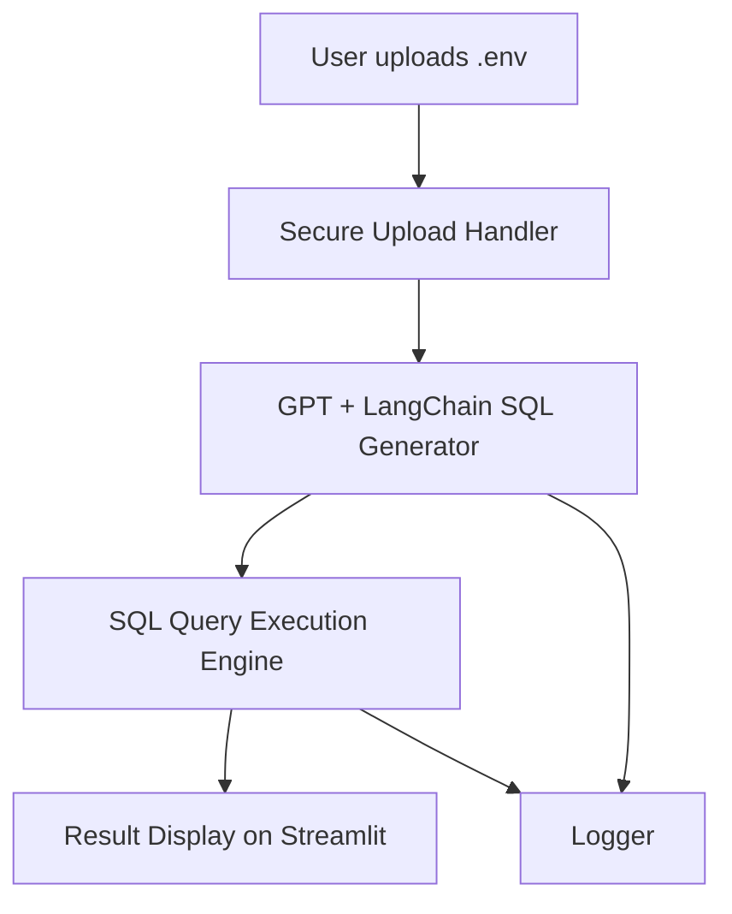

# SQL Chatbot with MLOps & GenAI

An intelligent SQL chatbot built using LangChain and Streamlit, designed to help users query remote databases using natural language. The app supports `.env` file uploads for secure database access, making it highly adaptable for enterprise workflows.

This project demonstrates modern practices in:
- Natural Language to SQL Generation using LLMs (LangChain + OpenAI)
- CI/CD-aligned containerization with Docker
- Real-time querying of production-grade relational databases
## Key Features

- **Secure DB Access via .env**  
  Upload a `.env` file with your database credentials (host, user, password, etc.) to instantly connect to your MySQL database; no hardcoding or environment setup required.

- **Natural Language to SQL Conversion**  
  Built using **LangChain** and **OpenAI**, this chatbot translates user queries like “Show me top 5 customers by revenue” into executable SQL.

- **Real-Time Query Execution**  
  Executes generated SQL queries on your actual production or test database and returns results instantly.

- **Dockerized for CI/CD Pipelines**  
  Fully containerized using Docker, making it ready for deployment into any MLOps workflow or scalable environment.

- **Structured Logging Support**  
  Includes a dedicated logging mechanism to track user inputs, query generations, and execution feedback (can be integrated into monitoring systems).

- **Modular & Extensible**  
  Designed with clean separation between UI, logic, and utilities — perfect for extension into larger GenAI pipelines or analytics dashboards.
## Use Cases & Impact

This project solves a major bottleneck in data-driven organizations: **non-technical stakeholders struggle to access the insights buried in their own data**.

### Business Use Cases

- **Marketing Teams** can ask, “What’s our most popular product by region?” — and get real-time answers from the database.
- **Sales Executives** can say, “Show deals over ₹1 crore closed last month.”
- **Operations Analysts** can explore, “Which suppliers delayed delivery in Q2?”

All without writing a single line of SQL.


## Project Architecture

This project is built with **modularity**, **security**, and **scalability** in mind. Here's how it works:

### Architecture Overview


---

### Key Components

- **`.env` Upload Interface**  
  - Lets each user connect to *their own* SQL database securely.
  - Avoids hardcoding credentials and supports multiple database types.

- **GPT + LangChain SQL Generator**  
  - Converts user input into **executable SQL queries**.
  - Uses OpenAI models + prompt engineering via LangChain for accurate results.

- **SQL Executor**  
  - Parses multiple SQL statements if needed.
  - Returns query results or logs errors cleanly.

- **Streamlit UI**  
  - Clean, modern interface for uploading configs, asking questions, and viewing data.
  - Can be run locally or deployed via Docker.

- **Docker Support**  
  - Wraps the entire app in a containerized environment for **easy deployment** on any system.

---

This architecture ensures the app is:

- Reusable across organizations
- Secure with dynamic user credentials
- Compatible with MLOps pipelines and CI/CD

## Getting Started

You can run this project either locally on your machine or via Docker.

---

### Option 1: Run Locally (for development)

#### Prerequisites:
- Python 3.10+
- MySQL server (running on your machine or remote)
- `.env` file with correct DB credentials (uploaded via app)

#### Steps:
```bash
# Clone the repository
git clone https://github.com/AnuragChaudhari9/SQLChatbot.git
cd SQLChatbot

# (Optional) Create virtual environment
python -m venv venv
venv\Scripts\activate    # On Windows

# Install dependencies
pip install -r requirements.txt

# Run Streamlit app
streamlit run app.py
```
## Using `sql.env` to Connect to Your Database

This application is designed to connect securely to any external MySQL server using a client-provided `sql.env` file.

---

### What is `sql.env`?

The `sql.env` file is a configuration file containing the credentials needed to connect to a MySQL database. It is uploaded by the user at runtime through the Streamlit UI.

This allows:

- Dynamic database connections without modifying the code
- Isolation of secrets and environment-specific credentials
- Support for multiple clients, each with their own database

---

### Required Format for `sql.env`

```
DB_HOST=localhost
DB_PORT=3306
DB_USER=your_mysql_user
DB_PASSWORD=your_mysql_password
DB_NAME=your_database_name
```

---

### `.env` for OpenAI key

See the provided example in the repository:  
`utils/env.example`.
This is the env file that will contain your OpenAI key.
## Key Features and Use Cases

This SQL Chatbot project blends Natural Language Processing (NLP) with database querying to provide an intuitive and secure data access layer for non-technical stakeholders.

---

### Key Features

- **Natural Language to SQL Translation**  
  Converts user queries (e.g., “Show me sales in June”) into optimized SQL commands using a GPT-based language model.

- **External MySQL Support**  
  Connects to any user-hosted MySQL server securely using a `.env` file, making it enterprise-ready.

- **Multi-query Execution**  
  Parses and executes multiple SQL statements intelligently, returning individual results clearly.

- **Streamlit Frontend**  
  Clean, interactive, and user-friendly UI built using Streamlit.

- **Robust Error Handling and Logging**  
  All errors and query steps are logged for easy debugging and traceability.

- **Dockerized Deployment**  
  Fully containerized app for easy local or cloud deployment, isolated from the client’s database environment.

---

### Real-World Use Cases

- **BI Teams**: Run ad hoc data queries without writing SQL.
- **Data Democratization**: Empower business analysts to self-serve insights.
- **Client Projects**: Integrate into customer-facing tools for querying their databases securely.
- **Training/Education**: Teach SQL concepts using natural language prompts.

---

## MLOps Alignment and Deployment Strategy

This project is designed to be production-ready and compatible with modern MLOps workflows. It demonstrates not only how to integrate GenAI into real business applications, but also how to deploy, monitor, and maintain such systems effectively.

---

### MLOps Relevance

- **Containerized Architecture (Docker)**  
  Enables environment consistency across development, staging, and production.

- **Config Separation via `.env`**  
  Promotes secure and modular infrastructure design by separating credentials from code.

- **Model Abstraction (LangChain)**  
  Supports flexible integration with OpenAI and other LLM providers without changing core logic.

- **Modular Codebase**  
  Designed with a separation of concerns (UI, logic, database, logging) to support CI/CD and automated testing.

- **Logging System**  
  All key actions and errors are tracked, enabling easy integration into monitoring platforms.

- **Extendability**  
  Easily scalable to add user authentication, RAG pipelines, cloud logging, or REST APIs.

---

### Deployment Strategy

- Run the container on any cloud VM (e.g., GCP, AWS EC2, Azure) using Docker
- Optionally integrate with CI/CD tools like GitHub Actions, Jenkins, or GitLab CI for continuous deployment
- Can be container-orchestrated with Kubernetes for multi-user support

---

### Future Enhancements

- Add authentication and session tracking
- Integrate more LLM providers or on-prem models
- Add query result caching and visualization
- Extend support to PostgreSQL or other DB engines

## Examples


